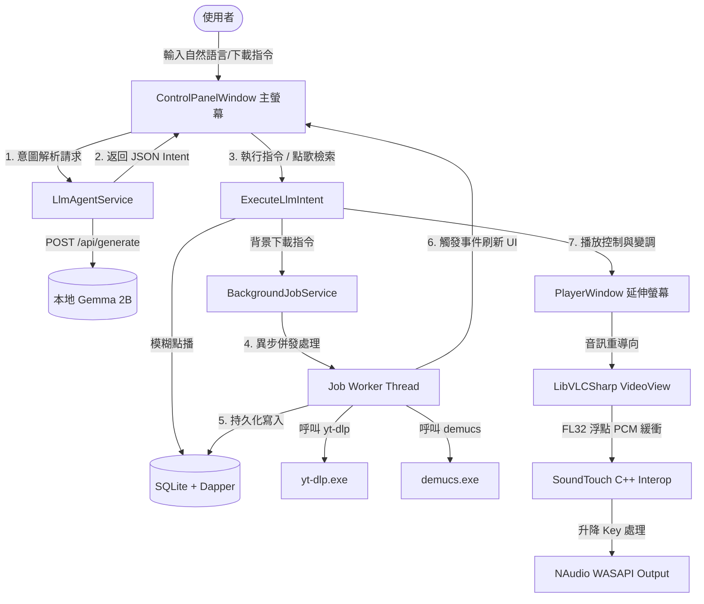

# KTV 系統技術架構與設計 Wiki (WIKI.md)

本文件詳細闡述「KTV 點歌與播放系統」的技術細節、底層架構、設計模式以及各模組間的連動機制。

---

## 1. 系統整體架構圖 (Architecture Overview)

系統採用極簡的服務層設計，完全避開了複雜的 Repository、Unit of Work 或重度 Event Bus，直接使用底層 API 或靜態引導器達成高效率的數據和狀態傳遞。



---

## 2. 核心子系統詳解

### 2.1 音訊重導向與變調管線 (NAudio + SoundTouch)

為了實現無失真、低延遲的即時變調，我們將播放與輸出解耦成兩個獨立的模組：

1. **音訊抓取 (LibVLC 回呼)**：
   * 在 VLC 載入媒體時，我們使用 `SetAudioFormat("FL32", 44100, 2)` 強制 VLC 將音軌解碼為 32 位元 IEEE 浮點數（小端），取樣率 44.1kHz 雙聲道。
   * 設定 `SetAudioCallbacks` 註冊播放回呼 `AudioPlayCallback`，攔截原本應輸出至音效卡的緩衝區。
2. **變調運算 (SoundTouch Interop)**：
   * SoundTouch 是以 C++ 編寫的高品質變調引擎。我們透過 [SoundTouchInterop.cs](file:///Users/shawnwang/Documents/agy/KTV/SoundTouchInterop.cs) 進行 P/Invoke。
   * `soundtouch_setPitchSemiTones(h, semitones)` 接受半音變數（範圍 $\pm 6$ 半音，如 `+1` 升半音，`-2` 降一個全音）。
   * `soundtouch_putSamples` 將 VLC 回呼得到的 float 陣列送入緩衝區，再呼叫 `soundtouch_receiveSamples` 提取變調後的 float 陣列。
3. **音訊輸出 (NAudio WASAPI)**：
   * 使用 NAudio 的 `WasapiOut` (低延遲共用模式) 作為實體輸出設備。
   * 將變調後的 float 資料使用 `Buffer.BlockCopy` 拷貝回 byte 陣列，寫入 `BufferedWaveProvider`。
   * WASAPI 設備會以 20ms 的間隔不斷從 `BufferedWaveProvider` 讀取資料並發聲，保障影音同步誤差 $\le \pm 15$ ms。
4. **防禦性直通 (macOS Bypass)**：
   * 由於 macOS 無法載入 `SoundTouch.dll` 或實體 Windows WASAPI，系統在 `SoundTouchProcessor` 加載失敗時會自動退回 **Bypass 模式**：
   * VLC 抓取的 PCM 數據直接寫入 `BufferedWaveProvider`，而 NAudio 在 Windows 以外平台自動降級為緩衝模擬而不呼叫實體音效設備，確保單元測試與跨平台建置暢通無阻。

---

### 2.2 LLM 語意解析與 JSON 強約束控制

使用者與 AI 對話時，系統需要把隨意的文字轉化為強型別的程式控制。

1. **強制 JSON 回應 (Format Constraint)**：
   * Ollama API 支援指定 `"format": "json"`，結合我們在 [LlmAgentService.cs](file:///Users/shawnwang/Documents/agy/KTV/LlmAgentService.cs) 中設定的 System Prompt，要求模型必須輸出特定結構的 JSON 字串：
     ```json
     {
       "Action": "Search" | "PitchChange" | "VocalToggle" | "Play" | "Pause" | "Next" | "Unknown",
       "Title": "song title",
       "Artist": "artist name",
       "Value": integer
     }
     ```
2. **意圖驅動路由 (Routing)**：
   * 主控制台接收到 JSON 並反序列化為 `LlmIntent` 後，依據 `Action` 執行指令：
     * `Search` $\rightarrow$ 使用 Dapper 連線 SQLite 對 `Songs` 表格做模糊匹配查詢，若匹配成功，通知 VLC 進行播放；若無匹配，回報用戶並建議其貼上網址下載。
     * `PitchChange` $\rightarrow$ 調用 `_playerWindow.SetPitch(currentPitch)` 進行動態變調。
     * `VocalToggle` $\rightarrow$ 透過 `_playerWindow.ToggleVocalChannel()` 切換聲道。

---

### 2.3 背景處理佇列 (Background Worker Queue)

網路歌曲點播（YouTube 下載與 Demucs 伴奏分離）是一項漫長的工作，必須保障不能阻塞 WPF UI 主線程。

1. **生產者-消費者佇列 (Producer-Consumer Queue)**：
   * 採用 `ConcurrentQueue<KtvJob>` 做為排隊容器，配合 `SemaphoreSlim` 信號鎖定。
   * 當用戶貼上 YouTube 網址時，主線程將任務放入佇列，釋放信號 `_signal.Release()`，背景任務線程 `ProcessQueueAsync` 隨即喚醒並序列化執行任務。
2. **進程捕獲 (Process wrapper)**：
   * 進程調用 `yt-dlp` 及 `demucs` 時，重定向 `StandardError` 抓取命令行輸出，並隨時更新進度百分比（如 `Downloading` 10%, `Separating` 50%）。
   * `JobStatusChanged` 事件會觸發控制台 UI，在 `Dispatcher.Invoke` 中非同步追加日誌至對話框。
3. **資料庫自動持久化 (Dapper Sync)**：
   * 當 Demucs 分離出 `vocals.wav` 及 `accompaniment.wav` 後，背景線程直接使用 Dapper 連線資料庫，插入 `YouTube` 來源的新歌記錄。
   * 任務完成後觸發 `Completed` 狀態更新，UI 監聽此狀態並自動呼叫 `LoadSongList()` 重新載入 sqlite 歌單以刷新 `DataGrid` 顯示。

---

## 3. 全域異常攔截策略 (Fail Loudly)

依據編碼準則第 12 條，我們建立了三層全域異常攔截器：

1. **`DispatcherUnhandledException` (UI 線程異常)**：
   * 捕獲並記錄所有在 WPF UI 線程發生的未處理異常。記錄完整的 StackTrace 後，彈出 `MessageBox` 提示用戶細節已寫入日誌，設置 `e.Handled = true` 阻止進程閃退。
2. **`AppDomain.CurrentDomain.UnhandledException` (後台線程致命異常)**：
   * 捕獲非 UI 線程中的致命異常。記錄日誌，告知用戶後退出。
3. **`TaskScheduler.UnobservedTaskException` (非同步 Task 遺漏異常)**：
   * 捕獲因未 await 或是未讀取 `.Result` 被垃圾回收時觸發的 Task 異常，調用 `e.SetObserved()` 阻止異常擴散崩潰進程。
